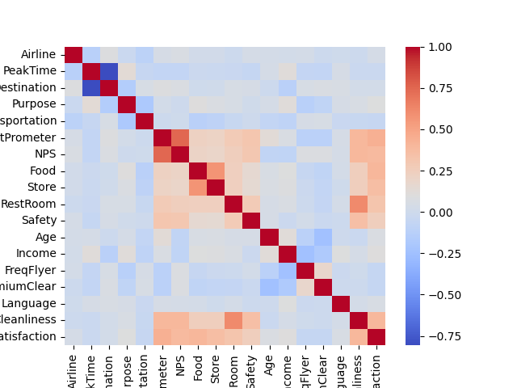
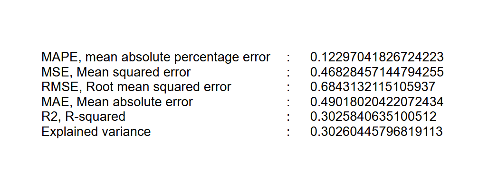
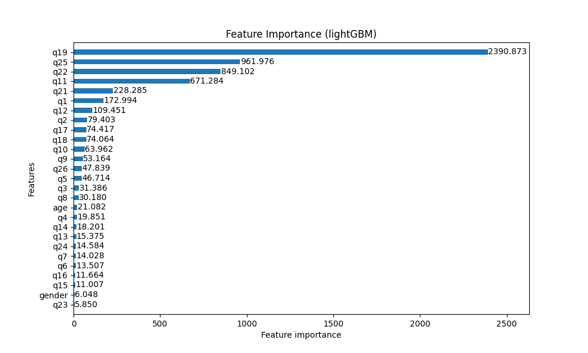
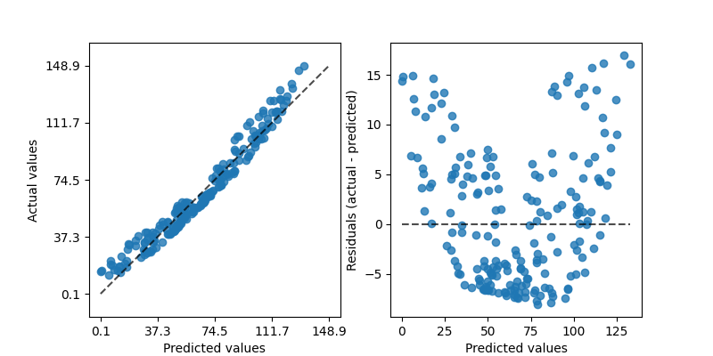
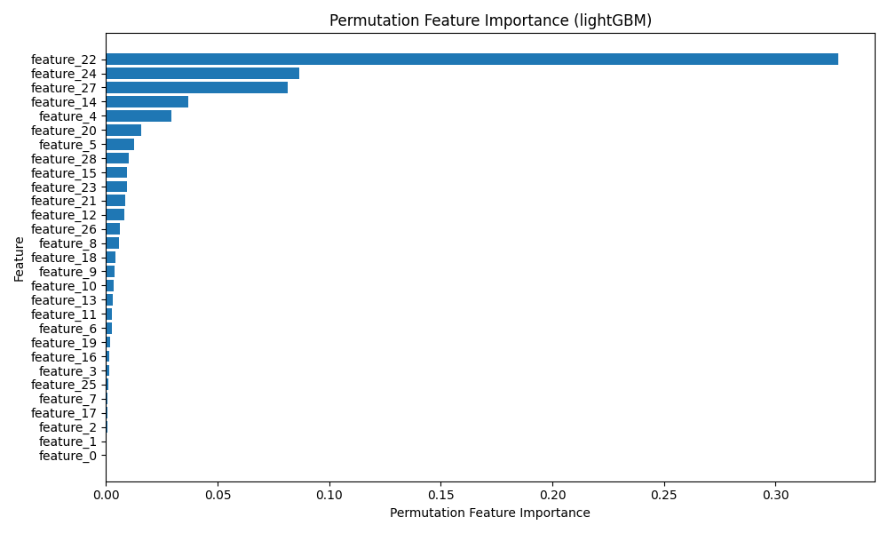
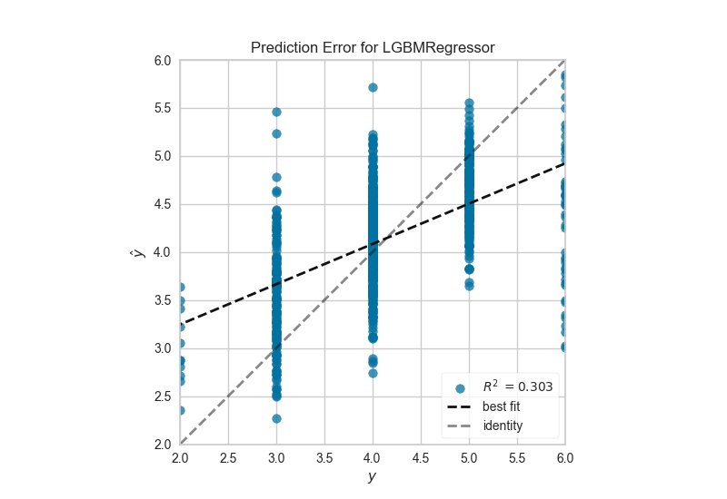
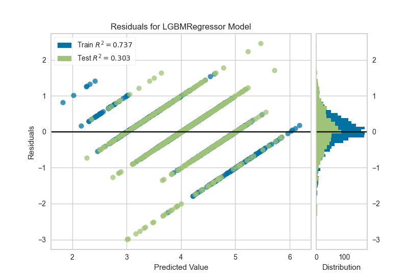

# Predicting Airport User Satisfaction using lightGBM Regression

Set working directory and load data

import os

import pandas as pd

os.chdir('dir')

df = pd.read_csv('airport2809.csv')

df.info()

## Import libraries

import lightgbm as lgb

import numpy as np

import seaborn as sns

from numpy import asarray

from numpy import mean

from numpy import std

from sklearn.datasets import make_regression

from lightgbm import LGBMRegressor

from sklearn.model_selection import cross_val_score

from sklearn.model_selection import RepeatedKFold

from matplotlib import pyplot

## Display correlation matrix

sns.heatmap(df.corr(), cmap='coolwarm')

## Dataset: extract features and target

X = df.drop('Satisfaction',axis=1)

y = df['Satisfaction']

## Split the data into Train and Test datasets

from sklearn.model_selection import train_test_split

X_train, X_test, y_train, y_test = train_test_split(X, y, test_size=0.30,
                                                          shuffle=False,
                                                          random_state = 1234)

## Initialize and train the LGBM regressor

model = LGBMRegressor(n_estimators=100, random_state=42)

## Fit the lightGBM model to the data

model.fit(X_train, y_train)

## Make predictions on the test set

y_pred = model.predict(X_test)

## Calculate evaluation metrics

from sklearn.metrics import root_mean_squared_error

from sklearn.metrics import mean_absolute_percentage_error, mean_squared_error, r2_score, explained_variance_score, mean_absolute_error

mape = mean_absolute_percentage_error(y_test, y_pred)

mse = mean_squared_error(y_test, y_pred)

rmse = root_mean_squared_error(y_test, y_pred)

mae = mean_absolute_error(y_test, y_pred)

r2 = r2_score(y_test, y_pred)

explained_var = explained_variance_score(y_test, y_pred)

## Print the evaluation metrics

print("MAPE, mean absolute percentage error:", mape)

print("MSE, Mean squared error:", mse)

print("RMSE, Root mean squared error:", rmse)

print("MAE, Mean absolute error:", mae)

print("R2, R-squared:", r2)

print("Explained variance:", explained_var)

## Feature importance

importance = model.feature_importances_

print(importance)

import matplotlib.pyplot as plt

lgb.plot_importance(model, importance_type='gain', figsize=(10, 6), height=.5, grid=False)

plt.title('Feature Importance (lightGBM)')

plt.show()

## Plot actual vs predicted values, and actual vs predicted residuals

import matplotlib.pyplot as plt

from sklearn.metrics import PredictionErrorDisplay

from sklearn.pipeline import make_pipeline

from sklearn.svm import SVR

from sklearn.preprocessing import StandardScaler

rng = np.random.default_rng(42)

X = rng.random(size=(200, 2)) * 10

y = X[:, 0]**2 + 5 * X[:, 1] + 10 + rng.normal(loc=0.0, scale=0.1, size=(200,))

reg = make_pipeline(StandardScaler(), SVR(kernel='linear', C=10))

reg.fit(X, y)

fig, axes = plt.subplots(1, 2, figsize=(8, 4))

PredictionErrorDisplay.from_estimator(reg, X, y, ax=axes[0], kind="actual_vs_predicted")

PredictionErrorDisplay.from_estimator(reg, X, y, ax=axes[1], kind="residual_vs_predicted")

plt.show()

## Permutation importance

Permutation feature importance is a powerful technique for evaluating the
importance of features in a machine learning model.
It works by randomly shuffling the values of each feature and measuring
the decrease in the model’s performance.
This provides a more reliable estimate of feature importance compared to
built-in importance measures, as it takes into account the interaction
between features.

from sklearn.inspection import permutation_importance

perm_importance = permutation_importance(model, X_test, y_test, n_repeats=10, random_state=42)

sorted_idx = perm_importance.importances_mean.argsort()

plt.figure(figsize=(10, 6))

plt.barh(range(len(sorted_idx)), perm_importance.importances_mean[sorted_idx], align='center')

plt.yticks(range(len(sorted_idx)), [f'feature_{i}' for i in sorted_idx])

plt.xlabel('Permutation Feature Importance')

plt.ylabel('Feature')

plt.title('Permutation Feature Importance (lightGBM)')

plt.tight_layout()

plt.show()

## Prediction error plot

A prediction error plot shows the actual targets from the dataset against the
predicted values generated by the model. This allows to see how much variance
is in the model. Analysts can diagnose regression models using this plot by
comparing against the 45 degree line, where the prediction exactly matches the model.

import yellowbrick

from yellowbrick.regressor import PredictionError

visualizer = PredictionError(model)

visualizer.fit(X_train, y_train)      # Fit the training data to the visualizer

visualizer.score(X_test, y_test)      # Evaluate the model on the test data

visualizer.show()                     # Finalize and render the figure

## Residuals plots on training and testing data

from yellowbrick.regressor import ResidualsPlot

visualizer = ResidualsPlot(model)

visualizer.fit(X_train, y_train)      # Fit the training data to the visualizer

visualizer.score(X_test, y_test)      # Evaluate the model on the test data

visualizer.show()                     # Finalize and render the figure

